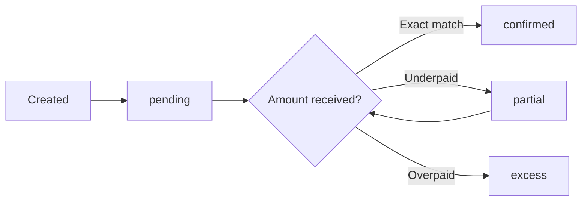
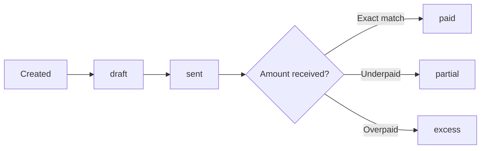

Every payment in Kibble follows a predictable lifecycle. A link or invoice starts as `pending`, an on-chain transfer is detected, and the status moves to `confirmed`, `partial`, or `excess` depending on the amount received. This page walks through each stage in detail, explains how the detection mechanism works, and covers the separate lifecycle that invoices follow.

## Payment link lifecycle

The full lifecycle of a payment link, from creation to final state:



<Note>
A link in `partial` status remains open. If the payer sends additional USDC to the same deposit address, the accumulated total is re-evaluated and the status updates accordingly.
</Note>

### Status definitions

<AccordionGroup>
  <Accordion title="pending — awaiting first transfer">
    The payment link has been created and the deposit address is registered with Alchemy. Kibble is watching for any USDC transfer to that address on Base. No funds have been received yet.
  </Accordion>
  <Accordion title="confirmed — exact amount received">
    The cumulative USDC received equals the expected amount. The payment is complete. No further action is required.
  </Accordion>
  <Accordion title="partial — underpaid">
    The amount received is less than the expected amount. The link stays open and Kibble continues monitoring the deposit address. If more USDC arrives later, the status is recalculated.
  </Accordion>
  <Accordion title="excess — overpaid">
    The amount received exceeds the expected amount. The merchant can see the overpaid amount in the portal and via webhook. Kibble does not automatically refund the difference — handling the excess is up to you and your payer.
  </Accordion>
</AccordionGroup>

## How on-chain detection works

When you create a payment link or invoice, Kibble:

1. Resolves or provisions a deposit address (see [Wallets](/concepts/wallets)).
2. Registers that address with Alchemy's Address Activity webhook via a `PUT` request to the Alchemy dashboard API.

From that point, Kibble monitors every transaction on Base that involves the deposit address. When a USDC transfer arrives:

<Steps>
  <Step title="Transfer detected">
    Kibble detects the incoming USDC transfer to the deposit address on Base.
  </Step>
  <Step title="Token verification">
    Kibble confirms that the received token is USDC on Base (`0x833589fCD6eDb6E08f4c7C32D4f71b54bdA02913`). Transfers of any other token are silently ignored.
  </Step>
  <Step title="Amount classification">
    Kibble compares the received value to the `expected_amount` set on the payment link:

    - Equal → `confirmed`
    - Less than → `partial`
    - Greater than → `excess`
  </Step>
  <Step title="Status update">
    The payment link status is updated immediately. The new status is visible in the merchant portal and returned by the status polling endpoint. If the link is associated with an invoice, the invoice status is updated at the same time.
  </Step>
</Steps>

## Invoice lifecycle

Invoices have a separate but related lifecycle. An invoice is backed by a payment link, and its status updates when the underlying payment link receives funds.



### Invoice status definitions

| Status | Meaning |
|---|---|
| `draft` | Invoice created. Not yet emailed to the vendor. |
| `sent` | Invoice emailed to the vendor. Awaiting payment. |
| `paid` | Received amount matches the invoice total exactly. |
| `partial` | Received amount is less than the invoice total. |
| `excess` | Received amount exceeds the invoice total. |

When an on-chain transfer updates a payment link to `confirmed`, Kibble maps that to the invoice status `paid`. The `partial` and `excess` statuses map directly.

### What happens when an invoice is paid

When the deposit address for an invoice receives a USDC transfer, Kibble:

1. Updates the invoice status (`paid`, `partial`, or `excess`) and records a `paid_at` timestamp.
2. Sends a payment confirmation email to the merchant with the invoice number, amount, and transaction hash.
3. If you registered a `webhook_url`, POSTs a signed JSON payload to your server:

```json
{
  "invoice_id": "a1b2c3d4-...",
  "invoice_number": "INV-0001",
  "status": "paid",
  "tx_hash": "0x...",
  "paid_amount": "1550.00",
  "paid_at": "2026-05-15T10:23:45.000Z"
}
```

The webhook is signed with `sha256={hex}` in the `X-Kibble-Signature` header using the `webhook_secret` returned at invoice creation time. See [Webhooks](/webhooks/overview) for verification details.

## Edge cases

<AccordionGroup>
  <Accordion title="Multiple transfers to the same address">
    If a payer sends USDC in multiple separate transactions, each one triggers the webhook. Kibble recalculates the total received against the expected amount on each event. A link moves from `partial` to `confirmed` (or `excess`) as soon as the cumulative total meets or exceeds the expected amount.
  </Accordion>
  <Accordion title="Transfer arrives before the link is registered">
    Alchemy address registration is a non-blocking async call. In the rare case that a transfer arrives before registration completes, the webhook will not fire for that transaction. This race condition is unlikely in practice but worth being aware of.
  </Accordion>
  <Accordion title="Duplicate payment detection">
    If the same on-chain transfer is detected more than once, Kibble deduplicates it automatically using the transaction hash. You will not see duplicate status changes for the same transaction.
  </Accordion>
  <Accordion title="Wrong token or wrong chain">
    Kibble silently ignores any transfer where the token contract does not match `0x833589fCD6eDb6E08f4c7C32D4f71b54bdA02913`. This includes ETH transfers, other ERC-20 tokens, and USDC on other chains such as Ethereum mainnet or Polygon.
  </Accordion>
</AccordionGroup>
